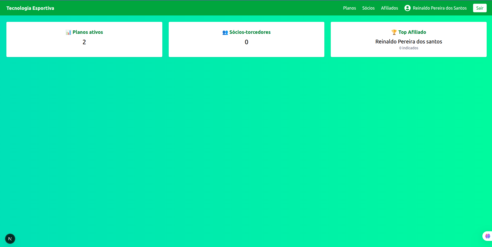
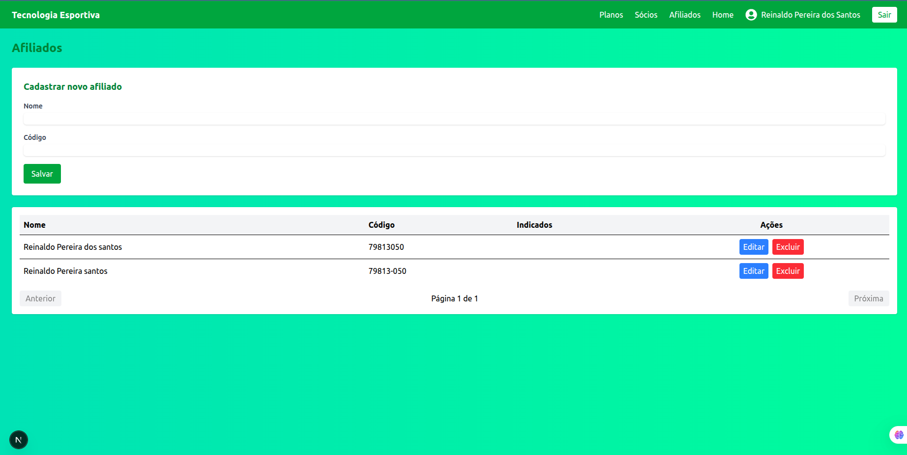
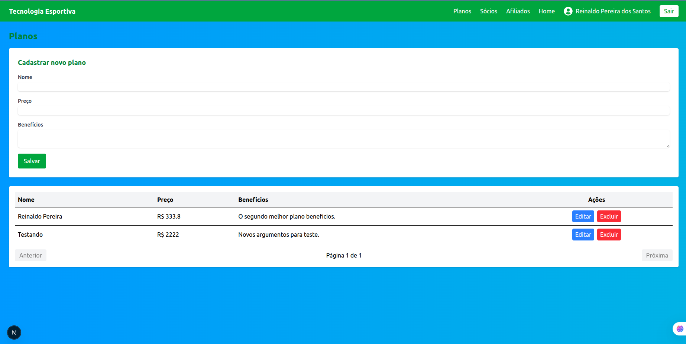
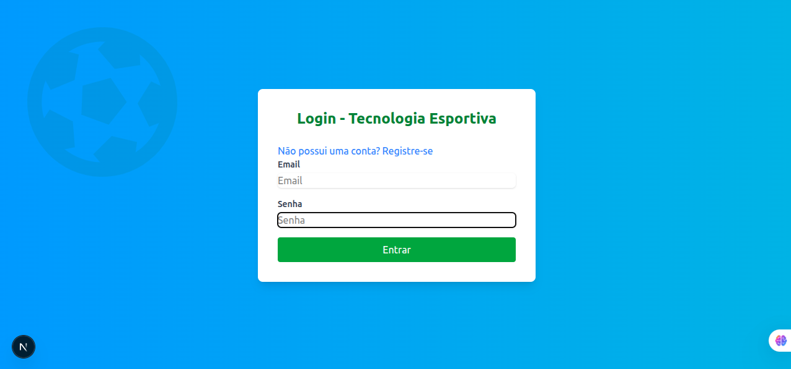

# 🧪 Desafio Técnico – Fullstack Pleno (Tecnologia Esportiva)

## 🎯 Objetivo
Construir uma aplicação fullstack simples para gerenciar sócios-torcedores e programas de afiliação, permitindo visualizar, cadastrar e relacionar sócios aos planos disponíveis.

O usuário só terá acesso a aplicação, mediante cadastro inicial e ser logado na aplicação.
A aplicação salva o usuário atual com JWT no cookie da sessão.

---

## Requerimentos
- Node >=20

## 🧩 Tecnologias utilizadas
- **Backend:** [NestJS](https://nestjs.com/) + [Prisma](https://www.prisma.io/) + [PostgreSQL](https://www.postgresql.org/)
- **Frontend:** [Next.js](https://nextjs.org/) + [TypeScript](https://www.typescriptlang.org/)
- **Documentação:** [Swagger](https://swagger.io/)
- **Infra:** Docker + Docker Compose
- **ContextApi** [ContextApi](https://pt-br.legacy.reactjs.org/docs/context.html)

---

## 📂 Estrutura do projeto

- /backend 

```bash
.
├── prisma
│   └── migrations
│       └── 20251212023138_init
├── src
│   ├── affiliates
│   │   └── dto
│   ├── auth
│   │   ├── dto
│   │   └── guards
│   ├── members
│   │   └── dto
│   ├── plan
│   │   └── dto
│   ├── prisma
│   └── users
│       └── dto
└── test
```

---

- /frontend

```bash
├── public
├── src
│   ├── app
│   │   ├── affiliates
│   │   │   └── components
│   │   ├── login
│   │   ├── members
│   │   │   └── components
│   │   ├── plans
│   │   │   └── components
│   │   └── register
│   ├── components
│   ├── context
│   ├── hooks
│   ├── provider
│   ├── services
│   └── types
└── __tests__
```


---

## ⚙️ Como executar localmente

### 1. Clonar o repositório
```bash
git clone https://github.com/reinaldoper/tecnologia-esportiva.git
cd tecnologia-esportiva
```

---

2. Configurar variáveis de ambiente
- Crie um arquivo .env dentro da pasta backend:

```bash
DATABASE_URL="postgresql://tecnologia:tecnologia@db:5432/tecnologia_db?schema=public"
PORT=3001
JWT_SECRET='chave_secreta'
```
- Crie um arquivo .env dentro da pasta frontend:

```bash
NEXT_PUBLIC_API_URL=http://localhost:3001/api
```

- Crie um arquivo .env na raiz do projeto:

```bash
POSTGRES_USER=tecnologia
POSTGRES_PASSWORD=tecnologia
POSTGRES_DB=tecnologia_db
```

---
3. Subir containers com Docker Compose
- Na raiz do projeto, execute:

```bash
docker-compose up -d
```

---

4. A aplicação estará rodando:

```bash
http://localhost:3000
```

---

### Isso irá subir:

- db → PostgreSQL

- backend → API NestJS

- frontend → Next.js

---

🚀 Scripts úteis
1. Backend

```bash

npm install


npx prisma migrate dev 


npm run start:dev
```

2. Frontend

```bash

npm install


npm run dev
```

---







📖 Endpoints principais
1. Planos
- POST /plans
- GET /plans
- GET /plans/:id
- PATCH /plans/:id
- DELETE /plans/:id

2. Sócios (Members)
- POST /members
- GET /members
- GET /members/:id
- PATCH /members/:id
- DELETE /members/:id

3. Afiliados
- POST /affiliates
- GET /affiliates
- GET /affiliates/:id
- PATCH /affiliates/:id
- DELETE /affiliates/:id
- GET /affiliates/:id/members-count (extra)
- GET /affiliates/ranking (extra)

🖥️ Frontend
- Lista de Planos
- Cadastro de Plano
- Lista de Sócios
- Cadastro de Sócio (selecionando plano)
- Lista de Afiliados
- Cadastro de Afiliado
- Visualização de detalhes de plano, membros associados e membros indicados por afiliado


### Testar o backend:

- Na raiz do projeto:

```bash
docker compose exec backend npm run test

#ou

docker compose exec backend npm run test:cov

```

### Testar o frontend:

- Na raiz do projeto:

```bash
docker compose exec frontend npm run test

```